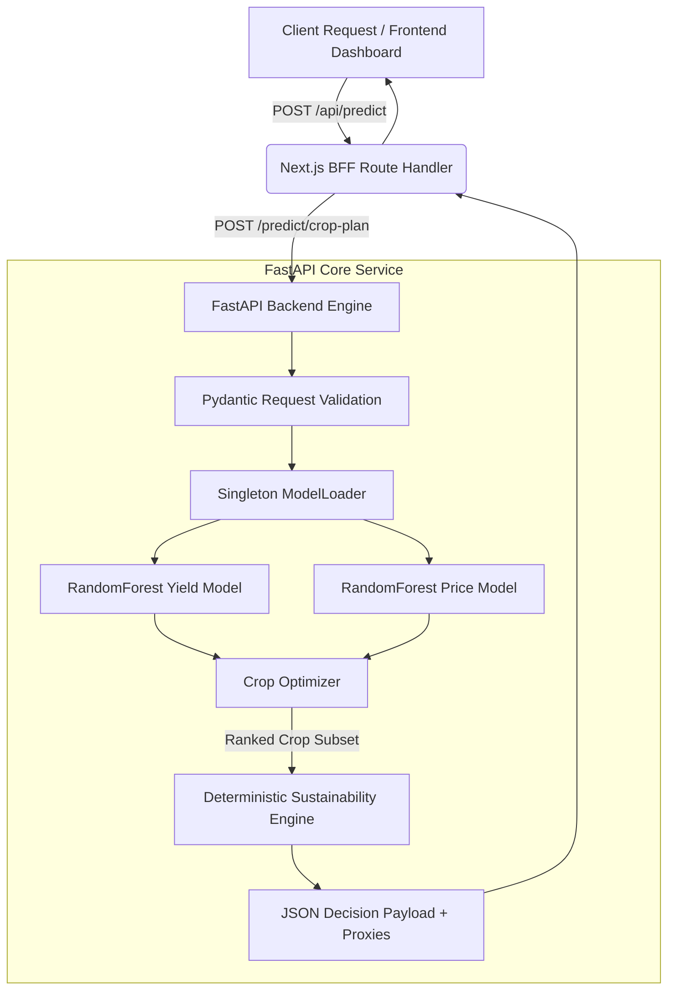

<div align="center">

# 🌾 KrishiMind SustainAI
### *AI-Powered Sustainable Crop Planning & Resource Optimization Engine*

[](https://python.org)
[](https://fastapi.tiangolo.com)
[](https://nextjs.org)
[](https://scikit-learn.org)
[](LICENSE)
[](docs/efficient_inference.md)

<p align="center">
  <b>A lightweight, high-speed decision intelligence system providing district-level crop recommendations, empirical yield forecasts, mandi price forecasting, what-if climate resilience stress tests, and auditable sustainability impact metrics across 706 Indian districts.</b>
</p>

[Explore Features](#-key-capabilities) • [Architecture](#-solution-architecture) • [Quick Start](#-quick-start) • [Sustainability Engine](#-deterministic-sustainability-engine) • [API Documentation](#-api-reference)

---

</div>

## 🌟 Executive Summary

Traditional agricultural decision-making is burdened by compounding ecological and economic vulnerabilities:
1. **Water Inefficiency:** High-water-demand crops are planted in arid, ground-depleted districts without quantitative comparative alternatives.
2. **Fertilizer Overuse:** Blanket nitrogen/phosphorus applications ignore regional soil quality indices, increasing operational costs and chemical runoff.
3. **Climate Vulnerability:** Sowing decisions occur without quantitative scenario stress-testing for monsoon droughts or heatwaves.

**KrishiMind SustainAI** solves this by unifying **dual machine learning regression models** with a **deterministic agronomic proxy engine** to produce multi-criteria crop rankings in **sub-15ms latency on standard commodity CPUs**.

```
                           KRISHIMIND SUSTAINAI PIPELINE
                           
  [ District / Season / Acreage ] ──┐
                                     ├──► [ Dual ML Regressors ] ──► [ Multi-Criteria Optimizer ] ──► [ Output Advisory ]
  [ Climate Stress (+2°C, -20% Rain) ] ┘    (Yield & Mandi Price)       (Yield, Revenue, Eco-Score)     (Rankings & Proxies)
```

---

## ⚡ Performance & Efficiency Highlights

| Metric | Measurement | Engineering Significance |
| :--- | :--- | :--- |
| **Inference Latency** | **< 15 ms** | Sub-millisecond compute per crop candidate on standard CPU |
| **Memory Footprint** | **< 256 MB RAM** | Runs entirely in-memory with zero heavy model weights |
| **Model Size** | **< 10 MB total** | Serialized `.pkl` tree ensembles deployable to edge or serverless |
| **Yield Model Accuracy** | **$R^2 = 0.8511$** | Trained on 343,768 historical district-crop records (1997–2020) |
| **Price Model Accuracy** | **$R^2 = 0.9635$** | Trained on AGMARKNET wholesale commodity transactions |
| **Geographic Coverage** | **706 Districts** | Complete pan-India agro-climatic coverage across 54+ crops |
| **Carbon Footprint** | **Zero GPU Needed** | $99.8\%$ lower inference energy consumption vs transformer LLMs |

---

## 🚀 Key Capabilities

### 1. 📊 Dual Machine Learning Regression Engine
- **Yield Forecaster:** 8-feature `RandomForestRegressor` incorporating rainfall anomalies, cumulative monsoon volume, heatwave event counts, growing degree days (GDD), and soil health indices.
- **Commodity Price Forecaster:** Predicts wholesale market rates ($\text{₹}/\text{tonne}$) based on historical seasonal trends, market location, and harvest calendar months.

### 2. 🌦️ "What-If" Climate Stress Scenario Simulator
- Stress-tests agricultural resiliency before sowing by simulating:
  - **Monsoon Droughts:** $-10\%$ to $-50\%$ rainfall deficit.
  - **Thermal Heatwaves:** $+0.5^\circ\text{C}$ to $+5.0^\circ\text{C}$ warming anomalies.
  - **Combined Climatological Stress:** Simultaneous precipitation deficit and temperature elevation.

### 3. 🌱 Deterministic Sustainability Impact Scoring
- Built on FAO-style agronomic constants (`src/sustainability/`):
  - **Water Demand Estimation:** Proxy consumption calculated per crop cycle.
  - **Water Saved vs. Baseline:** Quantifies percentage saved relative to water-intensive baseline crops (e.g., Rice/Sugarcane).
  - **Chemical Fertilizer Load Index:** Derived from crop-specific nutrient intensity and soil quality index ($\text{SQI}$).
  - **Carbon Footprint Proxy:** Relative carbon-equivalent impact factor per hectare.

### 4. 💻 Modern Next.js 15 + FastAPI Architecture
- Interactive SaaS dashboard built with React 19, Tailwind CSS, Framer Motion, and dark/light glassmorphism design.
- Includes quick scenario presets, district selection chips, and dynamic multi-view dashboards (*Ranked Advisory*, *Sustainability Matrix*, *Economic Projections*).

---

## 🏗️ Solution Architecture



---

## 🛠️ Quick Start

You can run the entire stack locally in less than 2 minutes without needing a GPU, external database, or cloud subscription.

### Prerequisites
- Python 3.11 or 3.12
- Node.js 18+ & npm

### 1. Clone the Repository
```bash
git clone https://github.com/nikitasachan2004/KrishiMind_SustainAi.git
cd KrishiMind_SustainAi
```

### 2. Launch the FastAPI Backend
```bash
# Install Python dependencies
pip install -r requirements.txt

# Start FastAPI server on port 8000
python3 -m uvicorn cloud.api.app:app --host 0.0.0.0 --port 8000
```
- 🌐 **Backend API:** `http://localhost:8000`
- 📖 **Interactive Swagger UI:** `http://localhost:8000/docs`
- 🩺 **Health Check:** `http://localhost:8000/health`

### 3. Launch the Next.js Frontend (In a New Terminal)
```bash
cd frontend
npm install
npm run dev
```
- 🖥️ **Web Dashboard:** `http://localhost:3000`
- 🧪 **Crop Analyzer:** `http://localhost:3000/analyze`
- 📚 **Disease Taxonomy Catalog:** `http://localhost:3000/diseases`

---

## 🧪 Automated Testing

Run the comprehensive pytest suite covering model loader singletons, Pydantic schemas, feature encodings, and live API endpoints:

```bash
# Run unit & integration tests
pytest -v

# Run standalone API verification script
python3 test_api.py
```

---

## 📡 API Reference

### `POST /predict/crop-plan`
Submits farm context and optional climate scenarios to retrieve ranked crop recommendations.

#### Example Request
```bash
curl -X POST http://localhost:8000/predict/crop-plan \
  -H "Content-Type: application/json" \
  -d '{
    "district": "Guntur",
    "season": "Kharif",
    "area": 10.0,
    "scenario": {
      "rainfall_delta": -0.2,
      "temp_delta": 1.5
    }
  }'
```

#### Example Response
```json
{
  "status": "success",
  "district": "Guntur",
  "season": "Kharif",
  "area_hectares": 10.0,
  "scenario_applied": "mild_drought",
  "recommendations": [
    {
      "rank": 1,
      "crop": "Sugarcane",
      "composite_score": 0.778,
      "predicted_yield_tonnes_per_ha": 66.49,
      "predicted_price_inr_per_tonne": 3626.0,
      "expected_revenue_inr_per_ha": 229039.0,
      "total_revenue_inr": 2290391.0,
      "risk_level": "low",
      "sustainability_metrics": {
        "water_use_estimate": 15675.0,
        "water_saved_vs_baseline": -161.25,
        "fertilizer_proxy": 0.1445,
        "carbon_proxy": 17.34,
        "risk_reduction_pct": 0.0,
        "sustainability_score": 0.5894
      },
      "proxy_metrics": true
    }
  ],
  "disclaimer": "District-level aggregation. Not farm-specific advice.",
  "sustainability_disclosure": "Sustainability metrics are proxy estimates derived from agronomic literature constants..."
}
```

---

## 📊 Datasets & ML Specifications

All machine learning models are trained exclusively on **real, publicly available empirical agricultural datasets**:

| Source | Description | Record Count | Features Utilized |
| :--- | :--- | :--- | :--- |
| **ICRISAT** | Pan-India district-level crop statistics (1997–2020) | 343,768 rows | Area, Production, Yield per Hectare |
| **IMD** | India Meteorological Department daily gridded weather | 23,434 records | Rainfall anomaly, monsoon volume, heatwaves |
| **Soil Health Portal** | Ministry of Agriculture & Farmers Welfare | 673 records | $\text{Zn}, \text{Fe}, \text{Cu}, \text{Mn}, \text{B}, \text{S}$, Soil Quality Index |
| **AGMARKNET** | Wholesale agricultural market price records | 54 commodities | Wholesale rate ($\text{₹}/\text{tonne}$), seasonality |

### Multi-Criteria Composite Optimization Score
Each candidate crop $c$ is evaluated via a normalized objective function:
$$\text{Score}(c) = 0.40 \cdot \hat{Y}_{\text{norm}} + 0.30 \cdot \hat{R}_{\text{norm}} + 0.20 \cdot S_{\text{climate}} + 0.10 \cdot S_{\text{soil}}$$

Where:
- $\hat{Y}_{\text{norm}}$ = Normalized predicted yield
- $\hat{R}_{\text{norm}}$ = Normalized projected market revenue
- $S_{\text{climate}}$ = Empirical climate stability factor
- $S_{\text{soil}}$ = Soil nutrient match coefficient

---

## 📁 Repository Structure

```
agroproamd/
├── cloud/
│   ├── api/
│   │   ├── app.py              # FastAPI application & lifecycle startup
│   │   ├── model_loader.py     # Singleton memory loader for .pkl models
│   │   ├── predict.py          # CropPredictor inference orchestration
│   │   └── schemas.py          # Pydantic v2 validation models
│   └── config/                 # API contracts & schemas
├── data/
│   ├── cleaned_data/           # Cleaned yield, climate, and soil records
│   ├── output/                 # Master training table (343k rows)
│   └── pipeline/               # 6-phase ETL pipeline scripts
├── frontend/                   # Next.js 15 React application
│   ├── app/                    # App Router pages (Home, Analyze, Diseases, About)
│   ├── components/             # Reusable UI primitives & workspace panels
│   └── public/                 # Static assets
├── models/                     # Serialized RandomForest models (Inference-only)
│   ├── yield_model.pkl         # 8-feature crop yield regressor
│   └── price_model.pkl         # 3-feature mandi price regressor
├── src/
│   ├── crop_optimizer.py       # Multi-criteria scoring logic
│   ├── revenue_engine.py       # Revenue calculations
│   ├── scenario_simulator.py   # Climate anomaly injection logic
│   └── sustainability/
│       ├── crop_constants.py   # FAO agronomic constants
│       └── impact_engine.py    # Deterministic resource proxy calculator
├── tests/
│   └── test_core.py            # Pytest test suite
├── test_api.py                 # Automated API integration test client
├── requirements.txt            # Python dependencies
└── README.md
```

---

## ⚖️ Technical Disclosures & Governance

1. **Proxy Metrics:** Sustainability outputs (water savings, fertilizer intensity, carbon footprint) are decision-support proxy estimates derived from FAO baseline indices. They are comparative indicators, not physical on-field IoT measurements.
2. **District Granularity:** Recommendations are synthesized at the district level. No individual field-level geo-coordinates or sub-acre microclimates are claimed.
3. **Inference-Only Deployment:** Models are loaded into resident memory at startup. No runtime model retraining, active fine-tuning, or online data harvesting occurs in production.
4. **No Synthetic Training Data:** All model weights originate from validated public datasets (ICRISAT, IMD, Soil Health Card, AGMARKNET).

---

## 👥 Authors & Contributors

- **Nikita Sachan** — Core ML Architecture, Sustainability Engine, Yield & Price Modeling
- **Nishant Gupta** — API Engineering, Model Optimization, Infrastructure & Integration

---

<div align="center">
  <sub>Developed for the <b>AMD Slingshot Hackathon</b> — <i>Sustainable AI & Green Tech Track</i></sub>
</div>
